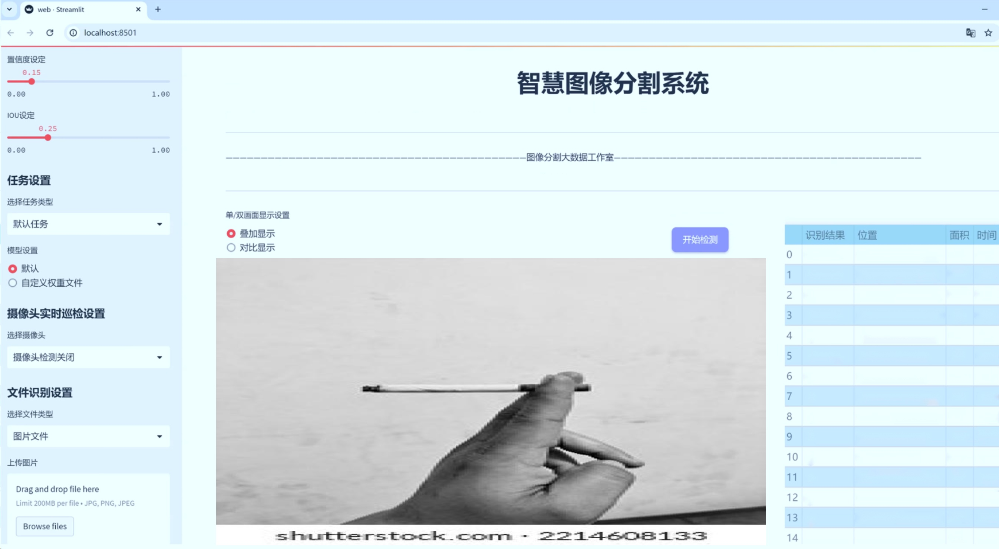
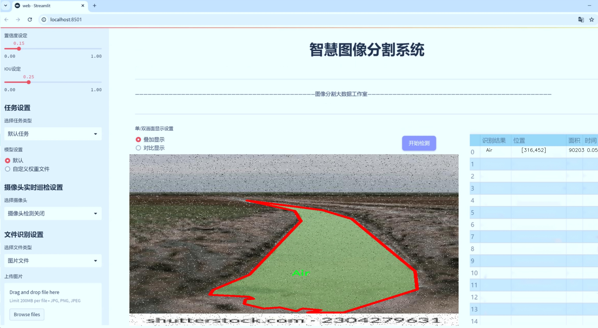
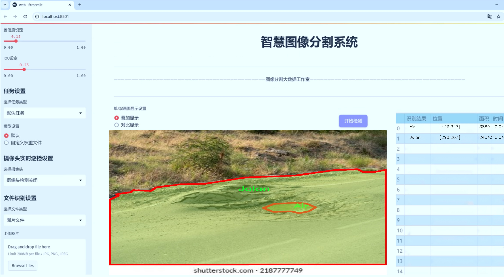
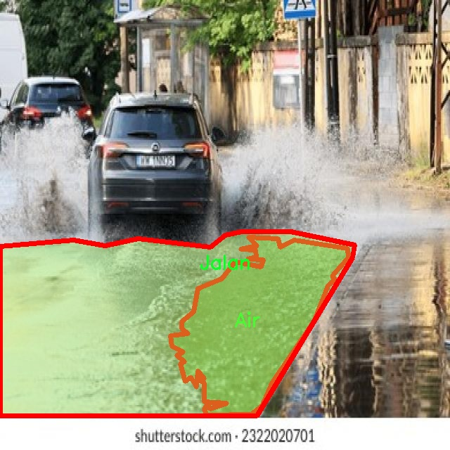
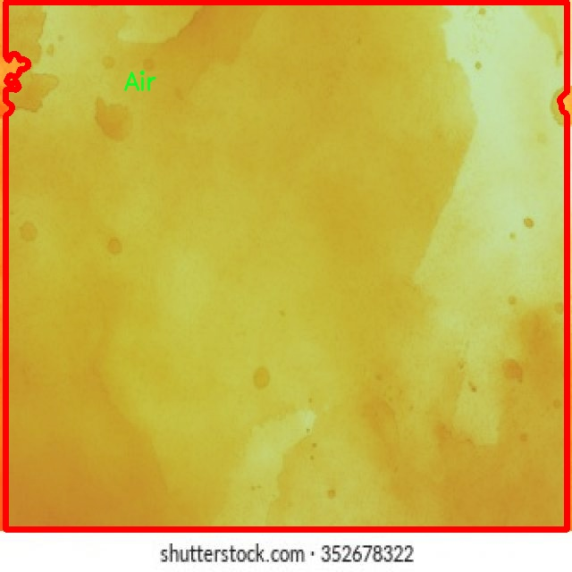

# 水体与道路分割系统： yolov8-seg-fasternet-bifpn

### 1.研究背景与意义

[参考博客](https://gitee.com/YOLOv8_YOLOv11_Segmentation_Studio/projects)

[博客来源](https://kdocs.cn/l/cszuIiCKVNis)

研究背景与意义

随着城市化进程的加快，水体与道路的管理与监测日益成为环境保护与城市规划的重要组成部分。水体不仅是生态系统的重要组成部分，还对城市的气候调节、景观美化和居民生活质量有着直接影响。而道路则是城市交通的动脉，直接关系到城市的运行效率和居民的出行便利。因此，准确、高效地进行水体与道路的分割与识别，对于实现可持续发展、优化城市管理具有重要的现实意义。

近年来，深度学习技术的迅猛发展为图像分割任务提供了新的解决方案。其中，YOLO（You Only Look Once）系列模型因其高效的实时检测能力而备受关注。YOLOv8作为该系列的最新版本，结合了多种先进的计算机视觉技术，展现出了在目标检测和分割任务中的优越性能。然而，尽管YOLOv8在多个领域取得了显著的成果，但在特定应用场景下，如水体与道路的分割，仍存在一定的挑战。这些挑战主要体现在复杂背景下的物体识别精度、细节处理能力以及模型的泛化能力等方面。因此，基于改进YOLOv8的水体与道路分割系统的研究显得尤为重要。

本研究将利用一个包含1400幅图像的数据集，该数据集专注于水体与道路的实例分割，具体分类包括“水”和“道路”两大类。通过对该数据集的深入分析，我们可以更好地理解水体与道路在不同环境条件下的特征表现，为模型的改进提供数据支持。实例分割技术不仅能够识别出物体的边界，还能为每个实例分配独立的标签，这对于复杂场景下的水体与道路分割尤为重要。

改进YOLOv8的关键在于优化其网络结构与训练策略，以提高模型在水体与道路分割任务中的表现。通过引入注意力机制、增强数据集的多样性以及采用更为精细的损失函数设计，我们期望提升模型的分割精度和鲁棒性。此外，研究还将探讨如何利用迁移学习等技术，进一步提升模型在不同地理环境和气候条件下的适应能力，从而实现更广泛的应用。

本研究的意义不仅在于推动水体与道路分割技术的发展，更在于为城市管理与环境保护提供有效的技术支持。通过高效的水体与道路监测系统，城市管理者可以实时获取水体和道路的变化信息，从而及时采取措施，优化资源配置，提升城市的可持续发展能力。同时，该研究也为其他领域的实例分割任务提供了新的思路和方法，具有广泛的应用前景。

综上所述，基于改进YOLOv8的水体与道路分割系统的研究，不仅具有重要的学术价值，更具备显著的社会意义。通过本研究的深入开展，我们期望为水体与道路的管理提供更为精准的技术手段，助力城市的可持续发展与生态环境的保护。

### 2.图片演示







注意：本项目提供完整的训练源码数据集和训练教程,由于此博客编辑较早,暂不提供权重文件（best.pt）,需要按照6.训练教程进行训练后实现上图效果。

### 3.视频演示

[3.1 视频演示](https://www.bilibili.com/video/BV1G6zmYbEZV/)

### 4.数据集信息

##### 4.1 数据集类别数＆类别名

nc: 2
names: ['Air', 'Jalan']


##### 4.2 数据集信息简介

数据集信息展示

在本研究中，我们使用了名为“Segmentasi air”的数据集，以支持对水体与道路的分割系统进行训练和改进，特别是针对YOLOv8-seg模型的应用。该数据集专注于两种主要类别的图像分割任务，分别是“Air”（水体）和“Jalan”（道路），为我们提供了丰富的标注数据，帮助模型更好地理解和识别这两种环境特征。

“Segmentasi air”数据集的设计初衷是为了提升计算机视觉领域中水体与道路的分割精度，尤其是在复杂的城市环境和自然景观中。数据集中包含了多样化的图像样本，这些样本涵盖了不同的光照条件、天气变化以及季节性特征，确保了模型在各种实际应用场景中的鲁棒性。每个图像都经过精确的标注，确保“Air”和“Jalan”这两类的边界清晰可辨，为模型的训练提供了高质量的输入。

在数据集的构建过程中，研究团队对图像的来源进行了严格筛选，确保数据的多样性和代表性。我们从城市街道、乡村道路、湖泊、河流等多种环境中收集了图像，确保模型能够学习到不同场景下水体与道路的特征。这种多样性不仅提高了模型的泛化能力，也使得在实际应用中，模型能够更准确地进行分割，减少误判和漏判的情况。

此外，数据集的类别数量设定为2，使得模型的训练过程更加聚焦和高效。通过专注于这两类，研究团队能够深入分析和优化YOLOv8-seg模型在特定任务上的表现，避免因类别过多而导致的复杂性和混淆。每一类的样本数量经过精心平衡，确保模型在学习过程中能够充分接触到每一类的特征，从而提升其分割精度。

在训练过程中，我们采用了数据增强技术，以进一步丰富数据集的多样性。这包括旋转、缩放、裁剪和颜色调整等方法，使得模型在面对未见过的图像时，依然能够保持较高的识别能力。通过这些技术，我们不仅提高了模型的鲁棒性，还增强了其在不同条件下的适应能力。

总之，“Segmentasi air”数据集为改进YOLOv8-seg的水体与道路分割系统提供了坚实的基础。通过精心设计的标注和多样化的样本，研究团队能够有效地训练出一个高效、准确的分割模型，满足实际应用需求。未来，我们期待该模型能够在智能交通、环境监测等领域发挥重要作用，为相关研究和应用提供强有力的支持。






### 5.项目依赖环境部署教程（零基础手把手教学）

[5.1 环境部署教程链接（零基础手把手教学）](https://www.bilibili.com/video/BV1jG4Ve4E9t/?vd_source=bc9aec86d164b67a7004b996143742dc)


[5.2 安装Python虚拟环境创建和依赖库安装视频教程链接（零基础手把手教学）](https://www.bilibili.com/video/BV1nA4VeYEze/?vd_source=bc9aec86d164b67a7004b996143742dc)

### 6.手把手YOLOV8-seg训练视频教程（零基础手把手教学）

[6.1 手把手YOLOV8-seg训练视频教程（零基础小白有手就能学会）](https://www.bilibili.com/video/BV1cA4VeYETe/?vd_source=bc9aec86d164b67a7004b996143742dc)


按照上面的训练视频教程链接加载项目提供的数据集，运行train.py即可开始训练



     Epoch   gpu_mem       box       obj       cls    labels  img_size
     1/200     0G   0.01576   0.01955  0.007536        22      1280: 100%|██████████| 849/849 [14:42<00:00,  1.04s/it]
               Class     Images     Labels          P          R     mAP@.5 mAP@.5:.95: 100%|██████████| 213/213 [01:14<00:00,  2.87it/s]
                 all       3395      17314      0.994      0.957      0.0957      0.0843

     Epoch   gpu_mem       box       obj       cls    labels  img_size
     2/200     0G   0.01578   0.01923  0.007006        22      1280: 100%|██████████| 849/849 [14:44<00:00,  1.04s/it]
               Class     Images     Labels          P          R     mAP@.5 mAP@.5:.95: 100%|██████████| 213/213 [01:12<00:00,  2.95it/s]
                 all       3395      17314      0.996      0.956      0.0957      0.0845

     Epoch   gpu_mem       box       obj       cls    labels  img_size
     3/200     0G   0.01561    0.0191  0.006895        27      1280: 100%|██████████| 849/849 [10:56<00:00,  1.29it/s]
               Class     Images     Labels          P          R     mAP@.5 mAP@.5:.95: 100%|███████   | 187/213 [00:52<00:00,  4.04it/s]
                 all       3395      17314      0.996      0.957      0.0957      0.0845


### 7.50+种全套YOLOV8-seg创新点加载调参实验视频教程（一键加载写好的改进模型的配置文件）

[7.1 50+种全套YOLOV8-seg创新点加载调参实验视频教程（一键加载写好的改进模型的配置文件）](https://www.bilibili.com/video/BV1Hw4VePEXv/?vd_source=bc9aec86d164b67a7004b996143742dc)

### YOLOV8-seg算法简介

原始YOLOv8-seg算法原理

YOLOv8-seg算法是YOLO系列目标检测模型的最新版本，旨在进一步提升目标检测的精度和速度，同时引入了分割功能，以适应更复杂的应用场景。该算法由Ultralytics团队于2023年1月提出，基于YOLOv5的架构，结合了近年来在计算机视觉领域的多项创新，形成了一种更为高效的目标检测和分割解决方案。

YOLOv8-seg的核心在于其网络结构的设计。与之前的YOLO版本相比，YOLOv8-seg在主干网络中引入了C2f模块，替代了传统的C3模块。C2f模块的设计灵感来源于YOLOv7中的ELAN（Efficient Layer Aggregation Network），其通过增加跳层连接，显著增强了梯度流的信息传递。这种结构不仅提高了模型的学习能力，还有效地减轻了计算负担，使得YOLOv8-seg在保持高精度的同时，能够实现更快的推理速度。

在数据预处理方面，YOLOv8-seg采用了一系列增强技术，包括Mosaic增强、混合增强、空间扰动和颜色扰动等。然而，值得注意的是，在训练的最后10个epoch中，YOLOv8-seg停止使用Mosaic增强，以避免数据分布的失真。这一策略的引入，使得模型在训练后期能够更好地适应真实场景中的数据分布，从而提升了模型的泛化能力。

YOLOv8-seg的颈部网络部分同样进行了优化，所有的C3模块被替换为C2f模块，进一步提升了特征融合的效果。该网络结构通过特征金字塔网络（FPN）和路径聚合网络（PAN）的结合，有效地整合了多尺度特征信息，确保了在不同尺寸目标的检测中都能保持较高的精度。此外，YOLOv8-seg在头部网络中采用了解耦头的设计，分别提取类别和位置特征。这种解耦结构使得模型在处理分类和定位任务时，能够更专注于各自的特征，从而提高了模型的收敛速度和预测精度。

在标签分配策略上，YOLOv8-seg采用了动态标签分配机制，借鉴了YOLOv6的TOOD策略。这一策略避免了依赖于数据集的静态候选框分配方式，能够根据实际情况动态调整正负样本的匹配，提升了模型在多尺度目标检测中的表现。YOLOv8-seg的损失函数设计也进行了创新，分类损失采用了Varifocal Loss（VFL），而回归损失则结合了CIoULoss与DFLLoss。这种损失函数的设计考虑到了正负样本的不同重要性，通过对高质量正样本的加权和对负样本的衰减，确保了模型在训练过程中能够更有效地学习到有用的特征。

在实际应用中，YOLOv8-seg表现出了优越的性能。其在COCO数据集上的实验结果显示，YOLOv8-seg在不同尺寸的模型中，均能在不显著增加参数量的情况下，取得更高的mAP（mean Average Precision）值。同时，在推理速度上，YOLOv8-seg也表现出了明显的优势，能够满足实时检测的需求。这一系列的改进，使得YOLOv8-seg在垃圾目标检测、自动驾驶、安防监控等领域展现出了广泛的应用潜力。

总的来说，YOLOv8-seg算法通过对网络结构的优化、数据处理策略的调整以及损失函数的创新，形成了一种高效、准确的目标检测与分割方案。其在处理复杂场景中的能力，使得YOLOv8-seg不仅仅是YOLO系列的延续，更是目标检测领域的一次重要突破。随着技术的不断进步，YOLOv8-seg无疑将在未来的计算机视觉应用中发挥更为重要的作用。


### 9.系统功能展示（检测对象为举例，实际内容以本项目数据集为准）

图9.1.系统支持检测结果表格显示

  图9.2.系统支持置信度和IOU阈值手动调节

  图9.3.系统支持自定义加载权重文件best.pt(需要你通过步骤5中训练获得)

  图9.4.系统支持摄像头实时识别

  图9.5.系统支持图片识别

  图9.6.系统支持视频识别

  图9.7.系统支持识别结果文件自动保存

  图9.8.系统支持Excel导出检测结果数据


### 10.50+种全套YOLOV8-seg创新点原理讲解（非科班也可以轻松写刊发刊，V11版本正在科研待更新）

#### 10.1 由于篇幅限制，每个创新点的具体原理讲解就不一一展开，具体见下列网址中的创新点对应子项目的技术原理博客网址【Blog】：


[10.1 50+种全套YOLOV8-seg创新点原理讲解链接](https://gitee.com/qunmasj/good)

#### 10.2 部分改进模块原理讲解(完整的改进原理见上图和技术博客链接)【如果此小节的图加载失败可以通过CSDN或者Github搜索该博客的标题访问原始博客，原始博客图片显示正常】
### YOLOv8简介
YOLOv8目标检测算法继承了YOLOv1系列的思考,是一种新型端到端的目标检测算法,尽管现在原始检测算法已经开源,但是鲜有发表的相关论文.YOLOv8的网络结构如图所示,主要可分为Input输入端、Backbone骨干神经网络、Neck 混合特征网络层和Head预测层网络共4个部分.

YOLO目标检测算法是一种端到端的One-Slage 目标检测算法，其核心思想是将图像按区域分块进行预测。YOLO将输入图像按照32x32的大小划分成若干个网格，例如416x416的图像将被划分为13x13个网格。当目标物体的中心位于某个网格内时,该网格就会负责输出该物体的边界框和类别置信度。每个网格可以预测多个边界框和多个目标类别,这些边界框和类别的数量可以根据需要进行设置。YOLO算法的输出是一个特征图,包含了每个网格对应的边界框和类别置信度的信息呵。本文采用YOLO最新的YOLOv8模型，其是2022年底发布的最新YOLO系列模型，采用全新的SOTA模型，全新的网络主干结构,如图1所示。
整个网络分为Backbone 骨干网络部分和Head头部网络部分。YOLOv8汲取了前几代网络的优秀特性，骨干网络和 Neck部分遵循CSP的思想，将YOLOv5中的C3模块被替换成了梯度流更丰富C2模块,去掉YOLOv5中 PAN-FPN上采样阶段中的卷积结构,将Backbone不同阶段输出的特征直接送入了上采样操作,模型提供了N/S/M/L/X尺度的不同大小模型,能够满足不同领域业界的需求。本文基于YOLOv8模型设计番茄病虫害检测系统，通过配置模型参数训练番茄图像,得到能够用于部署应用的最优模型。


### 感受野注意力卷积（RFAConv)
#### 标准卷积操作回顾
标准的卷积操作是构造卷积神经网络的基本构件。它利用具有共享参数的滑动窗口提取特征信息，克服了全连通层构造神经网络固有的参数多、计算开销大的问题。设 X R∈C×H×W
表示输入特征图，其中C、H、W分别表示特征图的通道数、高度、宽度。为了清楚地演示卷积核的特征提取过程，我们使用 C = 1 的例子。从每个接受域滑块中提取特征信息的卷积运算可以表示为:


这里，Fi 表示计算后每个卷积滑块得到的值，Xi 表示每个滑块内对应位置的像素值，K表示卷积核，S表示卷积核中的参数个数，N表示接收域滑块的总数。可以看出，每个滑块内相同位置的 feature共享相同的参数Ki。因此，标准的卷积运算并不能捕捉到不同位置所带来的信息差异，这最终在一定程度上限制了卷积神经网络的性能。 

#### 空间注意力回顾
目前，空间注意机制是利用学习得到的注意图来突出每个特征的重要性。与前一节类似，这里以 C=1为例。突出关键特征的空间注意机制可以简单表述为:这里，Fi 表示加权运算后得到的值。xi 和Ai 表示输入特征图和学习到的注意图在不同位置的值，N为输入特征图的高和宽的乘积，表示像素值的总数。


#### 空间注意与标准卷积运算
将注意力机制整合到卷积神经网络中，可以提高卷积神经网络的性能。通过对标准卷积运算和现有空间注意机制的研究，我们认为空间注意机制有效地克服了卷积神经网络固有的参数共享的局限性。目前卷积神经网络中最常用的核大小是 1 × 1和3 × 3。在引入空间注意机制后，提取特征的卷积操作可以是 1 × 1或3 × 3卷积操作。为了直观地展示这个过程，在 1 × 1卷积运算的前面插入了空间注意机制。通过注意图对输入特征图(Re-weight“×”)进行加权运算，最后通过 1 × 1卷积运算提取接收域的滑块特征信息。整个过程可以简单地表示如下:


 这里卷积核K仅代表一个参数值。如果取A i× ki 的值作为一种新的卷积核参数，有趣的是它解决了 1×1卷积运算提取特征时的参数共享问题。然而，关于空间注意机制的传说到此结束。当空间注意机制被插入到3×3卷积运算前面时。具体情况如下:


如上所述，如果取A的值 i × ki (4)式作为一种新的卷积核参数，完全解决了大规模卷积核的参数共享问题。然而，最重要的一点是，卷积核在提取每个接受域滑块的特征时，会共享一些特征。换句话说，每个接收域滑块内都有一个重叠。仔细分析后会发现A12= a21， a13 = a22， a15 = a24……，在这种情况下，每个滑动窗口共享空间注意力地图的权重。因此，空间注意机制没有考虑整个接受域的空间特征，不能有效地解决大规模卷积核的参数共享问题。因此，空间注意机制的有效性受到限制。 

#### 创新空间注意力和标准卷积操作
该博客提出解决了现有空间注意机制的局限性，为空间处理提供了一种创新的解决方案。受RFA的启发，一系列空间注意机制被开发出来，可以进一步提高卷积神经网络的性能。RFA可以看作是一个轻量级即插即用模块，RFA设计的卷积运算(RFAConv)可以代替标准卷积来提高卷积神经网络的性能。因此，我们预测空间注意机制与标准卷积运算的结合将继续发展，并在未来带来新的突破。
接受域空间特征:为了更好地理解接受域空间特征的概念，我们将提供相关的定义。接收域空间特征是专门为卷积核设计的，并根据核大小动态生成。如图1所示，以3×3卷积核为例。在图1中，“Spatial Feature”指的是原始的Feature map。“接受域空间特征”是空间特征变换后的特征图。

 

由不重叠的滑动窗口组成。当使用 3×3卷积内核提取特征时，接收域空间特征中的每个 3×3大小窗口代表一个接收域滑块。接受域注意卷积(RFAConv):针对接受域的空间特征，我们提出了接受域注意卷积(RFA)。该方法不仅强调了接收域滑块内不同特征的重要性，而且对接收域空间特征进行了优先排序。通过该方法，完全解决了卷积核参数共享的问题。接受域空间特征是根据卷积核的大小动态生成的，因此，RFA是卷积的固定组合，不能与卷积操作的帮助分离，卷积操作同时依赖于RFA来提高性能，因此我们提出了接受场注意卷积(RFAConv)。具有3×3大小的卷积核的RFAConv整体结构如图所示。


目前，最广泛使用的接受域特征提取方法是缓慢的。经过大量的研究，我们开发了一种快速的方法，用分组卷积来代替原来的方法。具体来说，我们利用相应大小的分组卷积来动态生成基于接受域大小的展开特征。尽管与原始的无参数方法(如PyTorch提供的nn.())相比，该方法增加了一些参数，但它的速度要快得多。注意:如前一节所述，当使用 3×3卷积内核提取特征时，接收域空间特征中的每个 3×3大小窗口表示一个接收域滑块。而利用快速分组卷积提取感受野特征后，将原始特征映射为新的特征。最近的研究表明。交互信息可以提高网络性能，如[40,41,42]所示。同样，对于RFAConv来说，通过交互接受域特征信息来学习注意图可以提高网络性能。然而，与每个接收域特征交互会导致额外的计算开销，因此为了最小化计算开销和参数的数量，我们使用AvgPool来聚合每个接收域特征的全局信息。然后，使用 1×1 组卷积操作进行信息交互。最后，我们使用softmax来强调每个特征在接受域特征中的重要性。一般情况下，RFA的计算可以表示为:


这里gi×i 表示一个大小为 i×i的分组卷积，k表示卷积核的大小，Norm表示归一化，X表示输入的特征图，F由注意图 a相乘得到 rf 与转换后的接受域空间特征 Frf。与CBAM和CA不同，RFA能够为每个接受域特征生成注意图。卷积神经网络的性能受到标准卷积操作的限制，因为卷积操作依赖于共享参数，对位置变化带来的信息差异不敏感。然而，RFAConv通过强调接收域滑块中不同特征的重要性，并对接收域空间特征进行优先级排序，可以完全解决这个问题。通过RFA得到的feature map是接受域空间特征，在“Adjust Shape”后没有重叠。因此，学习到的注意图将每个接受域滑块的特征信息聚合起来。换句话说，注意力地图不再共享在每个接受域滑块。这完全弥补了现有 CA和CBAM注意机制的不足。RFA为标准卷积内核提供了显著的好处。而在调整形状后，特征的高度和宽度是 k倍，需要进行 stride = k的k × k卷积运算来提取特征信息。RFA设计的卷积运算RFAConv为卷积带来了良好的增益，对标准卷积进行了创新。
此外，我们认为现有的空间注意机制应该优先考虑接受域空间特征，以提高网络性能。众所周知，基于自注意机制的网络模型[43,44,45]取得了很大的成功，因为它解决了卷积参数共享的问题，并对远程信息进行建模。然而，自注意机制也为模型引入了显著的计算开销和复杂性。我们认为，将现有的空间注意机制的注意力引导到接受场空间特征上，可以以类似于自我注意的方式解决长期信息的参数共享和建模问题。与自我关注相比，这种方法需要的参数和计算资源少得多。答案如下:(1)将以接收场空间特征为中心的空间注意机制与卷积相结合，消除了卷积参数共享的问题。(2)现有的空间注意机制已经考虑了远程信息，可以通过全局平均池或全局最大池的方式获取全局信息，其中明确考虑了远程信息。因此，我们设计了新的 CBAM和CA模型，称为RFCBAM和RFCA，它们专注于接受域空间特征。与RFA类似，使用最终的k × k stride = k 的卷积运算来提取特征信息。这两种新的卷积方法的具体结构如图 3所示，我们称这两种新的卷积操作为 RFCBAMConv和RFCAConv。与原来的CBAM相比，我们在RFCBAM中使用SE attention来代替CAM。因为这样可以减少计算开销。此外，在RFCBAM中，通道注意和空间注意不是分开执行的。相反，它们是同时加权的，使得每个通道获得的注意力地图是不同的。


### 11.项目核心源码讲解（再也不用担心看不懂代码逻辑）

#### 11.1 ultralytics\models\yolo\pose\train.py

以下是对给定代码的核心部分进行提炼和详细注释的结果：

```python
# 导入必要的库和模块
from copy import copy
from ultralytics.models import yolo
from ultralytics.nn.tasks import PoseModel
from ultralytics.utils import DEFAULT_CFG, LOGGER
from ultralytics.utils.plotting import plot_images, plot_results

class PoseTrainer(yolo.detect.DetectionTrainer):
    """
    PoseTrainer类，继承自DetectionTrainer，用于基于姿态模型的训练。
    """

    def __init__(self, cfg=DEFAULT_CFG, overrides=None, _callbacks=None):
        """初始化PoseTrainer对象，设置配置和覆盖参数。"""
        if overrides is None:
            overrides = {}
        overrides['task'] = 'pose'  # 设置任务类型为姿态估计
        super().__init__(cfg, overrides, _callbacks)  # 调用父类构造函数

        # 针对Apple MPS设备的已知问题发出警告
        if isinstance(self.args.device, str) and self.args.device.lower() == 'mps':
            LOGGER.warning("WARNING ⚠️ Apple MPS known Pose bug. Recommend 'device=cpu' for Pose models. "
                           'See https://github.com/ultralytics/ultralytics/issues/4031.')

    def get_model(self, cfg=None, weights=None, verbose=True):
        """获取姿态估计模型，使用指定的配置和权重。"""
        # 创建PoseModel实例
        model = PoseModel(cfg, ch=3, nc=self.data['nc'], data_kpt_shape=self.data['kpt_shape'], verbose=verbose)
        if weights:
            model.load(weights)  # 如果提供权重，则加载权重

        return model  # 返回模型实例

    def set_model_attributes(self):
        """设置PoseModel的关键点形状属性。"""
        super().set_model_attributes()  # 调用父类的方法
        self.model.kpt_shape = self.data['kpt_shape']  # 设置关键点形状

    def get_validator(self):
        """返回PoseValidator类的实例，用于验证。"""
        self.loss_names = 'box_loss', 'pose_loss', 'kobj_loss', 'cls_loss', 'dfl_loss'  # 定义损失名称
        return yolo.pose.PoseValidator(self.test_loader, save_dir=self.save_dir, args=copy(self.args))  # 返回验证器实例

    def plot_training_samples(self, batch, ni):
        """绘制一批训练样本，包括标注的类别标签、边界框和关键点。"""
        images = batch['img']  # 获取图像
        kpts = batch['keypoints']  # 获取关键点
        cls = batch['cls'].squeeze(-1)  # 获取类别
        bboxes = batch['bboxes']  # 获取边界框
        paths = batch['im_file']  # 获取图像文件路径
        batch_idx = batch['batch_idx']  # 获取批次索引
        
        # 绘制图像
        plot_images(images,
                    batch_idx,
                    cls,
                    bboxes,
                    kpts=kpts,
                    paths=paths,
                    fname=self.save_dir / f'train_batch{ni}.jpg',  # 保存文件名
                    on_plot=self.on_plot)  # 是否在绘图上显示

    def plot_metrics(self):
        """绘制训练和验证的指标。"""
        plot_results(file=self.csv, pose=True, on_plot=self.on_plot)  # 保存结果图像
```

### 代码核心部分说明：
1. **PoseTrainer类**：这是一个用于姿态估计训练的类，继承自YOLO的检测训练器。
2. **初始化方法**：设置任务类型为姿态估计，并处理设备相关的警告。
3. **获取模型**：创建并返回一个姿态模型实例，支持加载预训练权重。
4. **设置模型属性**：设置模型的关键点形状属性。
5. **获取验证器**：返回一个用于验证的PoseValidator实例，并定义损失名称。
6. **绘制训练样本**：将一批训练样本绘制成图像，包含关键点和边界框。
7. **绘制指标**：绘制训练和验证过程中的指标结果。

以上代码及注释为PoseTrainer类的核心功能和实现细节，适合用于姿态估计模型的训练与验证。

这个文件是一个用于训练姿态估计模型的Python脚本，属于Ultralytics YOLO框架的一部分。它扩展了YOLO的检测训练器，专门用于处理与姿态相关的任务。文件中定义了一个名为`PoseTrainer`的类，继承自`yolo.detect.DetectionTrainer`，提供了训练姿态模型所需的功能。

在类的初始化方法中，首先检查是否有覆盖的配置参数，如果没有，则创建一个空字典。接着，将任务类型设置为'pose'，并调用父类的初始化方法。此时，如果设备类型是'MPS'（Apple的Metal Performance Shaders），则会发出警告，建议使用'cpu'设备来避免已知的姿态模型问题。

`get_model`方法用于获取姿态估计模型，接受配置和权重参数。如果提供了权重，它会加载这些权重。模型的构造使用了`PoseModel`类，并根据数据集的类别数量和关键点形状进行初始化。

`set_model_attributes`方法用于设置模型的关键点形状属性，确保模型与数据集的关键点形状一致。

`get_validator`方法返回一个姿态验证器的实例，用于模型验证。它定义了损失名称，包括边界框损失、姿态损失、关键对象损失、类别损失和分布式焦点损失。

`plot_training_samples`方法用于绘制一批训练样本，包括带有注释的类标签、边界框和关键点。它会将图像、关键点、类别、边界框和文件路径传递给`plot_images`函数，并将结果保存为图像文件。

最后，`plot_metrics`方法用于绘制训练和验证的指标，通过调用`plot_results`函数生成结果图像，并保存为`results.png`文件。

总体来说，这个文件实现了姿态模型的训练、验证和可视化功能，为用户提供了一个高效的工具来进行姿态估计任务。

#### 11.2 ultralytics\nn\extra_modules\kernel_warehouse.py

以下是代码中最核心的部分，并附上详细的中文注释：

```python
import torch
import torch.nn as nn
import torch.nn.functional as F

class Attention(nn.Module):
    def __init__(self, in_planes, reduction, num_static_cell, num_local_mixture, norm_layer=nn.BatchNorm1d,
                 cell_num_ratio=1.0, nonlocal_basis_ratio=1.0, start_cell_idx=None):
        super(Attention, self).__init__()
        # 计算隐藏层的通道数
        hidden_planes = max(int(in_planes * reduction), 16)
        self.kw_planes_per_mixture = num_static_cell + 1  # 每个混合的通道数
        self.num_local_mixture = num_local_mixture  # 本地混合数
        self.kw_planes = self.kw_planes_per_mixture * num_local_mixture  # 总通道数

        # 计算本地和非本地单元的数量
        self.num_local_cell = int(cell_num_ratio * num_local_mixture)
        self.num_nonlocal_cell = num_static_cell - self.num_local_cell
        self.start_cell_idx = start_cell_idx

        # 定义网络层
        self.avgpool = nn.AdaptiveAvgPool1d(1)  # 自适应平均池化
        self.fc1 = nn.Linear(in_planes, hidden_planes, bias=(norm_layer is not nn.BatchNorm1d))  # 全连接层
        self.norm1 = norm_layer(hidden_planes)  # 归一化层
        self.act1 = nn.ReLU(inplace=True)  # 激活函数

        # 根据非本地基数比率选择映射方式
        if nonlocal_basis_ratio >= 1.0:
            self.map_to_cell = nn.Identity()  # 直接映射
            self.fc2 = nn.Linear(hidden_planes, self.kw_planes, bias=True)  # 第二个全连接层
        else:
            self.map_to_cell = self.map_to_cell_basis  # 使用基于映射
            self.num_basis = max(int(self.num_nonlocal_cell * nonlocal_basis_ratio), 16)  # 基数数量
            self.fc2 = nn.Linear(hidden_planes, (self.num_local_cell + self.num_basis + 1) * num_local_mixture, bias=False)
            self.fc3 = nn.Linear(self.num_basis, self.num_nonlocal_cell, bias=False)  # 非本地映射
            self.basis_bias = nn.Parameter(torch.zeros([self.kw_planes]), requires_grad=True).float()  # 基数偏置

        self.temp_bias = torch.zeros([self.kw_planes], requires_grad=False).float()  # 温度偏置
        self.temp_value = 0  # 温度值
        self._initialize_weights()  # 初始化权重

    def _initialize_weights(self):
        # 权重初始化
        for m in self.modules():
            if isinstance(m, nn.Linear):
                nn.init.kaiming_normal_(m.weight, mode='fan_out', nonlinearity='relu')  # Kaiming初始化
                if m.bias is not None:
                    nn.init.constant_(m.bias, 0)  # 偏置初始化为0
            if isinstance(m, nn.BatchNorm1d):
                nn.init.constant_(m.weight, 1)  # 批归一化权重初始化为1
                nn.init.constant_(m.bias, 0)  # 偏置初始化为0

    def forward(self, x):
        # 前向传播
        x = self.avgpool(x.reshape(*x.shape[:2], -1)).squeeze(dim=-1)  # 平均池化
        x = self.act1(self.norm1(self.fc1(x)))  # 线性变换 + 归一化 + 激活
        x = self.map_to_cell(self.fc2(x)).reshape(-1, self.kw_planes)  # 映射到单元
        x = x / (torch.sum(torch.abs(x), dim=1).view(-1, 1) + 1e-3)  # 归一化
        x = (1.0 - self.temp_value) * x.reshape(-1, self.kw_planes) + self.temp_value * self.temp_bias.to(x.device).view(1, -1)  # 温度调整
        return x.reshape(-1, self.kw_planes_per_mixture)[:, :-1]  # 返回结果

class KWconvNd(nn.Module):
    def __init__(self, in_planes, out_planes, kernel_size, stride=1, padding=0, dilation=1, groups=1,
                 bias=False, warehouse_id=None, warehouse_manager=None):
        super(KWconvNd, self).__init__()
        # 初始化卷积层参数
        self.in_planes = in_planes
        self.out_planes = out_planes
        self.kernel_size = kernel_size  # 卷积核大小
        self.stride = stride  # 步幅
        self.padding = padding  # 填充
        self.dilation = dilation  # 膨胀
        self.groups = groups  # 分组卷积
        self.bias = nn.Parameter(torch.zeros([self.out_planes]), requires_grad=True).float() if bias else None  # 偏置
        self.warehouse_id = warehouse_id  # 仓库ID
        self.warehouse_manager = [warehouse_manager]  # 仓库管理器

    def forward(self, x):
        # 前向传播
        kw_attention = self.attention(x).type(x.dtype)  # 获取注意力权重
        batch_size = x.shape[0]  # 批大小
        x = x.reshape(1, -1, *x.shape[2:])  # 重塑输入
        weight = self.warehouse_manager[0].take_cell(self.warehouse_id).reshape(self.cell_shape[0], -1).type(x.dtype)  # 获取权重
        aggregate_weight = torch.mm(kw_attention, weight)  # 加权
        output = F.conv2d(x, weight=aggregate_weight, bias=self.bias, stride=self.stride, padding=self.padding, dilation=self.dilation, groups=self.groups * batch_size)  # 卷积操作
        return output.view(batch_size, self.out_planes, *output.shape[2:])  # 返回输出

class Warehouse_Manager(nn.Module):
    def __init__(self, reduction=0.0625, cell_num_ratio=1, cell_inplane_ratio=1,
                 cell_outplane_ratio=1, sharing_range=(), nonlocal_basis_ratio=1,
                 norm_layer=nn.BatchNorm1d, spatial_partition=True):
        super(Warehouse_Manager, self).__init__()
        # 初始化仓库管理器参数
        self.sharing_range = sharing_range  # 共享范围
        self.warehouse_list = {}  # 仓库列表
        self.reduction = reduction  # 减少比例
        self.spatial_partition = spatial_partition  # 空间分区
        self.cell_num_ratio = cell_num_ratio  # 单元数量比例
        self.cell_outplane_ratio = cell_outplane_ratio  # 输出通道比例
        self.cell_inplane_ratio = cell_inplane_ratio  # 输入通道比例
        self.norm_layer = norm_layer  # 归一化层
        self.nonlocal_basis_ratio = nonlocal_basis_ratio  # 非本地基数比例
        self.weights = nn.ParameterList()  # 权重列表

    def reserve(self, in_planes, out_planes, kernel_size=1, stride=1, padding=0, dilation=1, groups=1,
                bias=True, warehouse_name='default', enabled=True, layer_type='conv2d'):
        # 创建动态卷积层并记录其信息
        if not enabled:
            return nn.Conv2d(in_planes, out_planes, kernel_size, stride=stride, padding=padding, dilation=dilation, groups=groups, bias=bias)
        else:
            weight_shape = [out_planes, in_planes // groups, *kernel_size]  # 权重形状
            if warehouse_name not in self.warehouse_list.keys():
                self.warehouse_list[warehouse_name] = []
            self.warehouse_list[warehouse_name].append(weight_shape)  # 记录权重形状
            return KWConv2d(in_planes, out_planes, kernel_size, stride=stride, padding=padding, dilation=dilation, groups=groups, bias=bias, warehouse_id=len(self.warehouse_list) - 1, warehouse_manager=self)

    def store(self):
        # 存储权重
        for warehouse_name in self.warehouse_list.keys():
            warehouse = self.warehouse_list[warehouse_name]
            # 计算每个仓库的权重
            # ... (省略具体实现)

    def allocate(self, network):
        # 分配权重到网络
        for layer in network.modules():
            if isinstance(layer, KWconvNd):
                # ... (省略具体实现)

    def take_cell(self, warehouse_idx):
        return self.weights[warehouse_idx]  # 获取指定仓库的权重
```

以上代码实现了一个带有注意力机制的卷积神经网络结构，使用了仓库管理器来动态管理卷积层的权重。通过对注意力机制的引入，网络能够更好地聚焦于重要特征，提高模型的表现。

这个程序文件 `kernel_warehouse.py` 是一个用于深度学习模型中卷积操作的扩展模块，主要实现了一个内核仓库管理器和相关的卷积层。文件中包含多个类和函数，以下是对其主要内容的讲解。

首先，文件导入了必要的 PyTorch 库，包括 `torch` 和 `torch.nn`，并定义了一些辅助函数和类。`parse` 函数用于解析输入参数，确保输入是可迭代的，并根据给定的数量返回相应的列表。

接下来，定义了 `Attention` 类，它是一个自定义的注意力机制模块。该模块通过输入的特征维度、缩减比例、静态单元数量和局部混合数量等参数来初始化。它包含多个线性层和归一化层，并在前向传播中计算注意力权重，最终输出经过处理的特征。

`KWconvNd` 类是一个通用的卷积层类，支持多维卷积（1D、2D、3D）。它的构造函数接收多个参数，包括输入和输出通道数、卷积核大小、步幅、填充等，并使用 `parse` 函数处理这些参数。该类还包含 `init_attention` 方法，用于初始化注意力机制，并在前向传播中计算卷积操作。

随后，`KWConv1d`、`KWConv2d` 和 `KWConv3d` 类分别继承自 `KWconvNd`，并指定了卷积的维度和相应的卷积函数。这些类实现了针对不同维度的卷积操作。

`KWLinear` 类则是一个线性层的实现，内部使用了 `KWConv1d` 来处理输入数据。

`Warehouse_Manager` 类是核心组件之一，用于管理内核仓库。它可以创建和存储不同卷积层的权重，并根据给定的参数进行动态调整。该类的构造函数接收多个参数，包括缩减比例、单元数量比例、共享范围等。它还包含 `reserve` 方法，用于创建卷积层而不初始化权重，并记录其信息。

`store` 方法用于计算和存储内核的权重，确保不同层之间的权重共享和管理。`allocate` 方法则用于分配权重并初始化它们。

最后，`KWConv` 类结合了卷积层和批归一化层，并在前向传播中依次执行卷积、归一化和激活操作。文件中还定义了一个 `get_temperature` 函数，用于根据当前迭代次数和训练周期计算温度值，这在某些模型中用于控制学习率或其他动态参数。

总体来说，这个文件实现了一个灵活的卷积层和内核管理机制，能够有效地处理深度学习模型中的卷积操作，并支持动态调整和权重共享。

#### 11.3 ultralytics\trackers\basetrack.py

以下是代码中最核心的部分，并附上详细的中文注释：

```python
from collections import OrderedDict
import numpy as np

class TrackState:
    """对象跟踪状态的枚举类。"""
    New = 0      # 新建状态
    Tracked = 1  # 被跟踪状态
    Lost = 2     # 丢失状态
    Removed = 3  # 被移除状态

class BaseTrack:
    """对象跟踪的基类，处理基本的跟踪属性和操作。"""

    _count = 0  # 全局跟踪ID计数器

    track_id = 0          # 跟踪ID
    is_activated = False   # 跟踪是否被激活
    state = TrackState.New # 当前跟踪状态

    history = OrderedDict() # 存储跟踪历史的有序字典
    features = []           # 特征列表
    curr_feature = None     # 当前特征
    score = 0              # 跟踪分数
    start_frame = 0        # 开始帧
    frame_id = 0           # 当前帧ID
    time_since_update = 0   # 自上次更新以来的时间

    # 多摄像头位置
    location = (np.inf, np.inf) # 跟踪对象的位置，初始化为无穷大

    @property
    def end_frame(self):
        """返回跟踪的最后帧ID。"""
        return self.frame_id

    @staticmethod
    def next_id():
        """递增并返回全局跟踪ID计数器。"""
        BaseTrack._count += 1
        return BaseTrack._count

    def activate(self, *args):
        """激活跟踪，使用提供的参数。"""
        raise NotImplementedError  # 该方法需要在子类中实现

    def predict(self):
        """预测跟踪的下一个状态。"""
        raise NotImplementedError  # 该方法需要在子类中实现

    def update(self, *args, **kwargs):
        """使用新的观测数据更新跟踪。"""
        raise NotImplementedError  # 该方法需要在子类中实现

    def mark_lost(self):
        """将跟踪标记为丢失。"""
        self.state = TrackState.Lost

    def mark_removed(self):
        """将跟踪标记为移除。"""
        self.state = TrackState.Removed

    @staticmethod
    def reset_id():
        """重置全局跟踪ID计数器。"""
        BaseTrack._count = 0
```

### 代码核心部分说明：
1. **TrackState 类**：定义了跟踪对象的不同状态，便于管理和识别跟踪对象的当前状态。
2. **BaseTrack 类**：这是一个跟踪对象的基类，包含了跟踪的基本属性和方法。
   - `track_id`：每个跟踪对象的唯一标识符。
   - `is_activated`：标识跟踪对象是否已激活。
   - `state`：当前跟踪状态，初始为新建状态。
   - `history` 和 `features`：用于存储跟踪历史和特征数据。
   - `next_id` 方法：用于生成新的跟踪ID。
   - `activate`、`predict` 和 `update` 方法：这些方法是抽象的，需要在子类中实现具体的逻辑。
   - `mark_lost` 和 `mark_removed` 方法：用于更新跟踪状态为丢失或移除。
   - `reset_id` 方法：用于重置全局跟踪ID计数器。

这个程序文件是一个用于对象跟踪的基础类，主要定义了跟踪对象的状态和基本操作。首先，文件中定义了一个枚举类 `TrackState`，用于表示跟踪对象的不同状态，包括新建（New）、跟踪中（Tracked）、丢失（Lost）和已移除（Removed）。

接下来，`BaseTrack` 类是对象跟踪的基类，包含了一些基本的属性和方法。该类的属性包括一个全局的跟踪 ID 计数器 `_count`，每个跟踪对象的 ID `track_id`，激活状态 `is_activated`，当前状态 `state`，历史记录 `history`，特征 `features`，当前特征 `curr_feature`，分数 `score`，起始帧 `start_frame`，当前帧 ID `frame_id`，自上次更新以来的时间 `time_since_update`，以及多摄像头的位置信息 `location`。

`BaseTrack` 类还定义了一些方法，包括获取跟踪的结束帧 ID 的属性 `end_frame`，一个静态方法 `next_id` 用于生成下一个跟踪 ID，激活跟踪的 `activate` 方法（未实现），预测下一个状态的 `predict` 方法（未实现），更新跟踪的 `update` 方法（未实现），标记跟踪为丢失的 `mark_lost` 方法，以及标记跟踪为已移除的 `mark_removed` 方法。最后，还有一个静态方法 `reset_id` 用于重置全局跟踪 ID 计数器。

总体来说，这个文件为对象跟踪提供了一个基础框架，允许开发者在此基础上实现具体的跟踪算法和逻辑。

#### 11.4 ultralytics\nn\backbone\SwinTransformer.py

以下是代码中最核心的部分，并附上详细的中文注释：

```python
import torch
import torch.nn as nn
import torch.nn.functional as F
import numpy as np

class Mlp(nn.Module):
    """ 多层感知机 (MLP) 模块。 """

    def __init__(self, in_features, hidden_features=None, out_features=None, act_layer=nn.GELU, drop=0.):
        super().__init__()
        out_features = out_features or in_features  # 输出特征数，如果未指定则与输入特征数相同
        hidden_features = hidden_features or in_features  # 隐藏层特征数，如果未指定则与输入特征数相同
        self.fc1 = nn.Linear(in_features, hidden_features)  # 第一层线性变换
        self.act = act_layer()  # 激活函数
        self.fc2 = nn.Linear(hidden_features, out_features)  # 第二层线性变换
        self.drop = nn.Dropout(drop)  # Dropout层

    def forward(self, x):
        """ 前向传播函数。 """
        x = self.fc1(x)  # 线性变换
        x = self.act(x)  # 激活
        x = self.drop(x)  # Dropout
        x = self.fc2(x)  # 线性变换
        x = self.drop(x)  # Dropout
        return x

class WindowAttention(nn.Module):
    """ 基于窗口的多头自注意力 (W-MSA) 模块。 """

    def __init__(self, dim, window_size, num_heads, qkv_bias=True, attn_drop=0., proj_drop=0.):
        super().__init__()
        self.dim = dim  # 输入通道数
        self.window_size = window_size  # 窗口大小
        self.num_heads = num_heads  # 注意力头数
        head_dim = dim // num_heads  # 每个头的维度
        self.scale = head_dim ** -0.5  # 缩放因子

        # 定义相对位置偏置参数表
        self.relative_position_bias_table = nn.Parameter(
            torch.zeros((2 * window_size[0] - 1) * (2 * window_size[1] - 1), num_heads))

        # 计算每个token在窗口内的相对位置索引
        coords_h = torch.arange(self.window_size[0])
        coords_w = torch.arange(self.window_size[1])
        coords = torch.stack(torch.meshgrid([coords_h, coords_w]))  # 生成网格坐标
        coords_flatten = torch.flatten(coords, 1)  # 展平坐标
        relative_coords = coords_flatten[:, :, None] - coords_flatten[:, None, :]  # 计算相对坐标
        relative_coords = relative_coords.permute(1, 2, 0).contiguous()  # 重新排列维度
        relative_coords[:, :, 0] += self.window_size[0] - 1  # 偏移
        relative_coords[:, :, 1] += self.window_size[1] - 1
        relative_coords[:, :, 0] *= 2 * self.window_size[1] - 1
        relative_position_index = relative_coords.sum(-1)  # 计算相对位置索引
        self.register_buffer("relative_position_index", relative_position_index)  # 注册为缓冲区

        self.qkv = nn.Linear(dim, dim * 3, bias=qkv_bias)  # 线性变换生成Q, K, V
        self.attn_drop = nn.Dropout(attn_drop)  # 注意力权重的Dropout
        self.proj = nn.Linear(dim, dim)  # 输出线性变换
        self.proj_drop = nn.Dropout(proj_drop)  # 输出的Dropout
        self.softmax = nn.Softmax(dim=-1)  # Softmax层

    def forward(self, x, mask=None):
        """ 前向传播函数。 """
        B_, N, C = x.shape  # 获取输入的批次大小、序列长度和通道数
        qkv = self.qkv(x).reshape(B_, N, 3, self.num_heads, C // self.num_heads).permute(2, 0, 3, 1, 4)  # 计算Q, K, V
        q, k, v = qkv[0], qkv[1], qkv[2]  # 分离Q, K, V

        q = q * self.scale  # 缩放Q
        attn = (q @ k.transpose(-2, -1))  # 计算注意力得分

        # 添加相对位置偏置
        relative_position_bias = self.relative_position_bias_table[self.relative_position_index.view(-1)].view(
            self.window_size[0] * self.window_size[1], self.window_size[0] * self.window_size[1], -1)
        relative_position_bias = relative_position_bias.permute(2, 0, 1).contiguous()  # 重新排列维度
        attn = attn + relative_position_bias.unsqueeze(0)  # 加入相对位置偏置

        if mask is not None:
            attn = attn + mask.unsqueeze(1).unsqueeze(0)  # 加入掩码
        attn = self.softmax(attn)  # 计算注意力权重
        attn = self.attn_drop(attn)  # Dropout

        x = (attn @ v).transpose(1, 2).reshape(B_, N, C)  # 计算输出
        x = self.proj(x)  # 线性变换
        x = self.proj_drop(x)  # Dropout
        return x

class SwinTransformer(nn.Module):
    """ Swin Transformer 主体。 """

    def __init__(self, patch_size=4, in_chans=3, embed_dim=96, depths=[2, 2, 6, 2], num_heads=[3, 6, 12, 24]):
        super().__init__()
        self.patch_embed = PatchEmbed(patch_size=patch_size, in_chans=in_chans, embed_dim=embed_dim)  # 图像分块嵌入
        self.layers = nn.ModuleList()  # 存储每一层的列表

        # 构建每一层
        for i_layer in range(len(depths)):
            layer = BasicLayer(
                dim=int(embed_dim * 2 ** i_layer),
                depth=depths[i_layer],
                num_heads=num_heads[i_layer]
            )
            self.layers.append(layer)

    def forward(self, x):
        """ 前向传播函数。 """
        x = self.patch_embed(x)  # 图像分块嵌入
        for layer in self.layers:
            x = layer(x)  # 逐层前向传播
        return x  # 返回最终输出

def SwinTransformer_Tiny(weights=''):
    """ 创建一个小型的Swin Transformer模型。 """
    model = SwinTransformer(depths=[2, 2, 6, 2], num_heads=[3, 6, 12, 24])  # 初始化模型
    if weights:
        model.load_state_dict(torch.load(weights)['model'])  # 加载权重
    return model
```

### 代码说明：
1. **Mlp类**：实现了一个多层感知机，包括两个线性层和一个激活函数。
2. **WindowAttention类**：实现了窗口自注意力机制，计算输入特征的注意力权重，并加入相对位置偏置。
3. **SwinTransformer类**：构建了Swin Transformer的主体，包含图像分块嵌入和多个基本层（BasicLayer）。
4. **SwinTransformer_Tiny函数**：用于创建一个小型的Swin Transformer模型，并可选择加载预训练权重。

这些部分是Swin Transformer模型的核心，包含了模型的基本结构和功能。

这个程序文件实现了Swin Transformer模型的主要结构，Swin Transformer是一种用于计算机视觉任务的层次化视觉Transformer架构。代码中定义了多个类和函数，主要包括多层感知机（Mlp）、窗口划分（window_partition）、窗口反转（window_reverse）、窗口注意力（WindowAttention）、Swin Transformer块（SwinTransformerBlock）、补丁合并（PatchMerging）、基本层（BasicLayer）、补丁嵌入（PatchEmbed）以及Swin Transformer主类（SwinTransformer）。

首先，Mlp类定义了一个多层感知机，包括两个线性层和一个激活函数（默认为GELU），并在每个线性层后添加了Dropout以防止过拟合。forward方法实现了前向传播过程。

接下来，window_partition和window_reverse函数用于将输入特征图划分为窗口和将窗口合并回特征图。这是Swin Transformer中窗口注意力机制的基础。

WindowAttention类实现了基于窗口的多头自注意力机制，支持相对位置偏置。它在前向传播中计算查询、键、值，并应用相对位置偏置和注意力掩码。最终，计算得到的注意力结果会经过线性变换和Dropout。

SwinTransformerBlock类定义了Swin Transformer的基本块，包含了归一化层、窗口注意力层和多层感知机。它还实现了短路连接和DropPath，以增强模型的表现力和稳定性。

PatchMerging类用于将特征图划分为补丁并进行合并，主要用于下采样操作。BasicLayer类则定义了一个基本的Swin Transformer层，包含多个Swin Transformer块，并在必要时进行下采样。

PatchEmbed类实现了图像到补丁的嵌入，将输入图像划分为不重叠的补丁，并通过卷积层进行线性投影。

SwinTransformer类是整个模型的核心，负责构建模型的各个层，并实现前向传播。它支持绝对位置嵌入、随机深度、输出层的归一化等功能。

最后，update_weight函数用于更新模型的权重，SwinTransformer_Tiny函数则用于创建一个小型的Swin Transformer模型，并加载预训练权重（如果提供）。

整体而言，这个文件实现了Swin Transformer的完整结构，适用于各种计算机视觉任务，如图像分类、目标检测等。

#### 11.5 ultralytics\engine\exporter.py

以下是代码中最核心的部分，并附上详细的中文注释：

```python
class Exporter:
    """
    用于导出模型的类。

    属性:
        args (SimpleNamespace): 导出器的配置。
        callbacks (list, optional): 回调函数列表。默认为 None。
    """

    def __init__(self, cfg=DEFAULT_CFG, overrides=None, _callbacks=None):
        """
        初始化 Exporter 类。

        参数:
            cfg (str, optional): 配置文件的路径。默认为 DEFAULT_CFG。
            overrides (dict, optional): 配置覆盖。默认为 None。
            _callbacks (dict, optional): 回调函数的字典。默认为 None。
        """
        self.args = get_cfg(cfg, overrides)  # 获取配置
        self.callbacks = _callbacks or callbacks.get_default_callbacks()  # 设置回调函数

    @smart_inference_mode()
    def __call__(self, model=None):
        """运行导出过程并返回导出的文件/目录列表。"""
        self.run_callbacks('on_export_start')  # 运行导出开始的回调
        fmt = self.args.format.lower()  # 将格式转换为小写
        fmts = tuple(export_formats()['Argument'][1:])  # 获取可用的导出格式
        flags = [x == fmt for x in fmts]  # 检查所请求的格式是否有效
        if sum(flags) != 1:
            raise ValueError(f"无效的导出格式='{fmt}'。有效格式为 {fmts}")

        # 设备选择
        self.device = select_device('cpu' if self.args.device is None else self.args.device)

        # 检查模型类名
        model.names = check_class_names(model.names)

        # 检查图像大小
        self.imgsz = check_imgsz(self.args.imgsz, stride=model.stride, min_dim=2)

        # 输入数据
        im = torch.zeros(self.args.batch, 3, *self.imgsz).to(self.device)  # 创建输入张量

        # 更新模型
        model = deepcopy(model).to(self.device)  # 深拷贝模型并移动到指定设备
        model.eval()  # 设置模型为评估模式
        model.float()  # 确保模型为浮点数格式
        model = model.fuse()  # 融合模型层以优化性能

        # 进行干运行以确保模型正常工作
        for _ in range(2):
            _ = model(im)  # 干运行

        # 进行导出
        f = [''] * len(fmts)  # 初始化导出文件名列表
        if 'torchscript' in fmt:  # 导出为 TorchScript
            f[0], _ = self.export_torchscript()
        if 'onnx' in fmt:  # 导出为 ONNX
            f[1], _ = self.export_onnx()

        # 完成导出
        f = [str(x) for x in f if x]  # 过滤掉空值
        self.run_callbacks('on_export_end')  # 运行导出结束的回调
        return f  # 返回导出的文件/目录列表

    @try_export
    def export_onnx(self, prefix=colorstr('ONNX:')):
        """导出为 YOLOv8 ONNX 格式。"""
        # 检查所需的库
        requirements = ['onnx>=1.12.0']
        check_requirements(requirements)  # 检查库是否安装

        # 开始导出
        f = str(self.file.with_suffix('.onnx'))  # 设置导出文件名
        torch.onnx.export(
            self.model.cpu(),  # 将模型移动到 CPU
            self.im.cpu(),  # 将输入移动到 CPU
            f,  # 导出文件名
            input_names=['images'],  # 输入名称
            output_names=['output0'],  # 输出名称
            dynamic_axes={'images': {0: 'batch', 2: 'height', 3: 'width'}}  # 动态轴
        )
        return f, None  # 返回导出文件名
```

### 代码核心部分说明：
1. **Exporter 类**：用于处理模型的导出操作，初始化时获取配置并设置回调函数。
2. **__call__ 方法**：运行导出过程，选择设备，检查模型和图像大小，并执行导出操作。
3. **export_onnx 方法**：负责将模型导出为 ONNX 格式，确保所需库已安装，并进行必要的设置。

### 关键功能：
- **动态轴**：允许在导出时处理不同大小的输入。
- **回调机制**：在导出开始和结束时运行自定义回调，便于扩展和监控导出过程。
- **错误处理**：在不支持的格式或参数错误时抛出异常，确保导出过程的稳定性。

这个程序文件 `exporter.py` 是 Ultralytics YOLOv8 模型的导出模块，主要用于将训练好的 YOLOv8 PyTorch 模型导出为多种格式，以便在不同的推理环境中使用。文件开头的文档字符串列出了支持的导出格式，包括 PyTorch、TorchScript、ONNX、OpenVINO、TensorRT、CoreML、TensorFlow SavedModel、TensorFlow Lite、TensorFlow Edge TPU、TensorFlow.js、PaddlePaddle 和 ncnn，并提供了相应的命令行和 Python 接口示例。

文件中导入了许多必要的库，包括 JSON、OS、Shutil、Subprocess、时间、警告、NumPy 和 PyTorch，以及 Ultralytics 的一些模块和工具函数。接下来定义了一些辅助函数和类。

`export_formats` 函数返回一个包含支持的导出格式的 DataFrame，方便后续的格式检查和选择。`gd_outputs` 函数用于获取 TensorFlow GraphDef 模型的输出节点名称。`try_export` 是一个装饰器，用于捕获导出过程中的异常并记录成功或失败的信息。

`Exporter` 类是导出过程的核心，包含多个方法来处理不同格式的导出。初始化方法接受配置文件路径和覆盖参数，并设置回调函数。`__call__` 方法是导出过程的主要入口，负责处理导出格式的选择、设备选择、模型检查、输入准备等。它会根据用户指定的格式调用相应的导出方法。

导出方法包括 `export_torchscript`、`export_onnx`、`export_openvino`、`export_paddle`、`export_ncnn`、`export_coreml`、`export_engine`、`export_saved_model`、`export_pb`、`export_tflite`、`export_edgetpu` 和 `export_tfjs`。每个方法都实现了特定格式的导出逻辑，并在导出完成后返回导出的文件路径。

在导出过程中，程序会进行一系列的检查和预处理，例如检查设备类型、模型参数、输入图像大小等。对于某些格式，如 TensorRT 和 Edge TPU，程序会确保在 GPU 上进行导出。导出完成后，程序会记录导出结果，并提供后续推理和验证的命令。

此外，`Exporter` 类还支持回调机制，允许用户在导出过程的不同阶段插入自定义操作。通过 `add_callback` 和 `run_callbacks` 方法，用户可以灵活地扩展导出过程。

总的来说，这个文件实现了 YOLOv8 模型的多格式导出功能，提供了灵活的配置和丰富的导出选项，方便用户在不同的推理平台上使用训练好的模型。

### 12.系统整体结构（节选）

### 整体功能和构架概括

Ultralytics 是一个用于计算机视觉任务的深度学习框架，主要实现了 YOLO（You Only Look Once）系列模型。该框架的构架包括多个模块，涵盖了模型训练、推理、对象跟踪、特征提取和模型导出等功能。具体来说：

1. **模型训练**：`train.py` 文件负责姿态估计模型的训练，提供了训练过程中的数据处理、模型构建、损失计算和可视化功能。
2. **卷积操作扩展**：`kernel_warehouse.py` 文件实现了卷积层和内核管理机制，支持动态调整和权重共享，增强了模型的灵活性和表现力。
3. **对象跟踪**：`basetrack.py` 文件定义了对象跟踪的基础类，提供了跟踪对象的状态管理和基本操作，为具体的跟踪算法提供了框架。
4. **Swin Transformer**：`SwinTransformer.py` 文件实现了Swin Transformer模型的结构，适用于各种计算机视觉任务，如图像分类和目标检测。
5. **模型导出**：`exporter.py` 文件负责将训练好的模型导出为多种格式，以便在不同的推理环境中使用，支持灵活的配置和丰富的导出选项。

### 文件功能整理表

| 文件路径                                          | 功能描述                                                     |
|--------------------------------------------------|------------------------------------------------------------|
| `ultralytics/models/yolo/pose/train.py`          | 实现姿态估计模型的训练，包括数据处理、模型构建和可视化功能。 |
| `ultralytics/nn/extra_modules/kernel_warehouse.py` | 提供卷积层和内核管理机制，支持动态调整和权重共享。           |
| `ultralytics/trackers/basetrack.py`              | 定义对象跟踪的基础类，管理跟踪对象的状态和基本操作。         |
| `ultralytics/nn/backbone/SwinTransformer.py`     | 实现Swin Transformer模型的结构，适用于多种计算机视觉任务。   |
| `ultralytics/engine/exporter.py`                 | 负责将训练好的模型导出为多种格式，支持灵活的配置和导出选项。  |

这个表格总结了每个文件的主要功能，展示了 Ultralytics 框架在计算机视觉任务中的多样性和灵活性。

### 13.图片、视频、摄像头图像分割Demo(去除WebUI)代码

在这个博客小节中，我们将讨论如何在不使用WebUI的情况下，实现图像分割模型的使用。本项目代码已经优化整合，方便用户将分割功能嵌入自己的项目中。
核心功能包括图片、视频、摄像头图像的分割，ROI区域的轮廓提取、类别分类、周长计算、面积计算、圆度计算以及颜色提取等。
这些功能提供了良好的二次开发基础。

### 核心代码解读

以下是主要代码片段，我们会为每一块代码进行详细的批注解释：

```python
import random
import cv2
import numpy as np
from PIL import ImageFont, ImageDraw, Image
from hashlib import md5
from model import Web_Detector
from chinese_name_list import Label_list

# 根据名称生成颜色
def generate_color_based_on_name(name):
    ......

# 计算多边形面积
def calculate_polygon_area(points):
    return cv2.contourArea(points.astype(np.float32))

...
# 绘制中文标签
def draw_with_chinese(image, text, position, font_size=20, color=(255, 0, 0)):
    image_pil = Image.fromarray(cv2.cvtColor(image, cv2.COLOR_BGR2RGB))
    draw = ImageDraw.Draw(image_pil)
    font = ImageFont.truetype("simsun.ttc", font_size, encoding="unic")
    draw.text(position, text, font=font, fill=color)
    return cv2.cvtColor(np.array(image_pil), cv2.COLOR_RGB2BGR)

# 动态调整参数
def adjust_parameter(image_size, base_size=1000):
    max_size = max(image_size)
    return max_size / base_size

# 绘制检测结果
def draw_detections(image, info, alpha=0.2):
    name, bbox, conf, cls_id, mask = info['class_name'], info['bbox'], info['score'], info['class_id'], info['mask']
    adjust_param = adjust_parameter(image.shape[:2])
    spacing = int(20 * adjust_param)

    if mask is None:
        x1, y1, x2, y2 = bbox
        aim_frame_area = (x2 - x1) * (y2 - y1)
        cv2.rectangle(image, (x1, y1), (x2, y2), color=(0, 0, 255), thickness=int(3 * adjust_param))
        image = draw_with_chinese(image, name, (x1, y1 - int(30 * adjust_param)), font_size=int(35 * adjust_param))
        y_offset = int(50 * adjust_param)  # 类别名称上方绘制，其下方留出空间
    else:
        mask_points = np.concatenate(mask)
        aim_frame_area = calculate_polygon_area(mask_points)
        mask_color = generate_color_based_on_name(name)
        try:
            overlay = image.copy()
            cv2.fillPoly(overlay, [mask_points.astype(np.int32)], mask_color)
            image = cv2.addWeighted(overlay, 0.3, image, 0.7, 0)
            cv2.drawContours(image, [mask_points.astype(np.int32)], -1, (0, 0, 255), thickness=int(8 * adjust_param))

            # 计算面积、周长、圆度
            area = cv2.contourArea(mask_points.astype(np.int32))
            perimeter = cv2.arcLength(mask_points.astype(np.int32), True)
            ......

            # 计算色彩
            mask = np.zeros(image.shape[:2], dtype=np.uint8)
            cv2.drawContours(mask, [mask_points.astype(np.int32)], -1, 255, -1)
            color_points = cv2.findNonZero(mask)
            ......

            # 绘制类别名称
            x, y = np.min(mask_points, axis=0).astype(int)
            image = draw_with_chinese(image, name, (x, y - int(30 * adjust_param)), font_size=int(35 * adjust_param))
            y_offset = int(50 * adjust_param)

            # 绘制面积、周长、圆度和色彩值
            metrics = [("Area", area), ("Perimeter", perimeter), ("Circularity", circularity), ("Color", color_str)]
            for idx, (metric_name, metric_value) in enumerate(metrics):
                ......

    return image, aim_frame_area

# 处理每帧图像
def process_frame(model, image):
    pre_img = model.preprocess(image)
    pred = model.predict(pre_img)
    det = pred[0] if det is not None and len(det)
    if det:
        det_info = model.postprocess(pred)
        for info in det_info:
            image, _ = draw_detections(image, info)
    return image

if __name__ == "__main__":
    cls_name = Label_list
    model = Web_Detector()
    model.load_model("./weights/yolov8s-seg.pt")

    # 摄像头实时处理
    cap = cv2.VideoCapture(0)
    while cap.isOpened():
        ret, frame = cap.read()
        if not ret:
            break
        ......

    # 图片处理
    image_path = './icon/OIP.jpg'
    image = cv2.imread(image_path)
    if image is not None:
        processed_image = process_frame(model, image)
        ......

    # 视频处理
    video_path = ''  # 输入视频的路径
    cap = cv2.VideoCapture(video_path)
    while cap.isOpened():
        ret, frame = cap.read()
        ......
```


### 14.完整训练+Web前端界面+50+种创新点源码、数据集获取


# [下载链接：https://mbd.pub/o/bread/Z5yWlpxp](https://mbd.pub/o/bread/Z5yWlpxp)